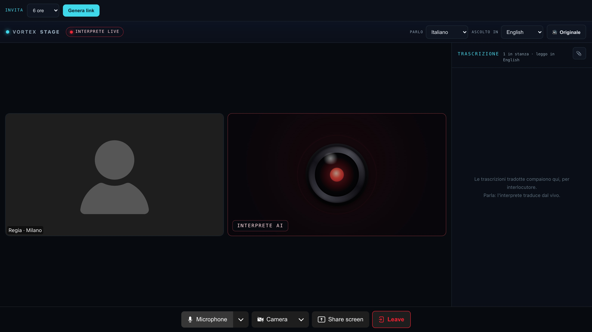
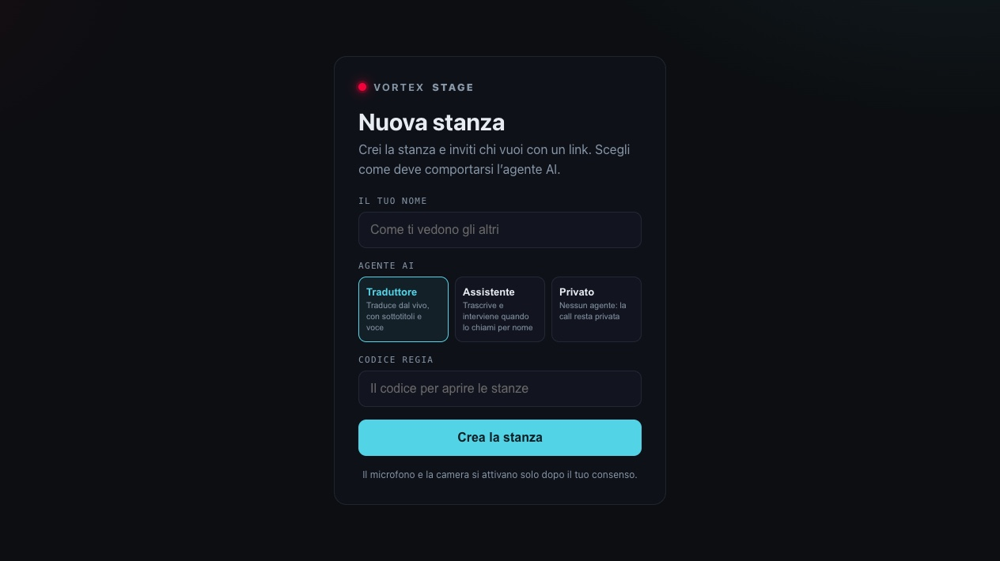

<a href="README.md">Italiano</a> · <strong>English</strong>

🌐 <a href="https://solarys431.github.io/vortex-communication-os/">Landing page</a>

---

## What it is

VORTEX Meet is a **functional prototype** for multilingual meetings. An **AI simultaneous translation module** produces translated voice and captions across ten supported languages; an **assistant** transcribes the session and generates minutes and a summary when it ends. It works as a standalone product and is prepared for future broadcast integrations.

---

## Main features

### Three modes: translate, assist or stay private

When creating a room, choose **Translation** for live voice and captions, **Assistant** for transcription and on-demand responses, or **Private** with no agent. Participants join through a link; microphone and camera are enabled only after consent.

### Spoken and written simultaneous translation

Each participant can hear and read the translation in the selected language. Ten languages are supported: Italian, English, Spanish, French, German, Portuguese, Dutch, Russian, Japanese and Chinese. A data channel is prepared for future broadcast integrations.

### Live captions and meeting minutes

Translated captions are attributed to the participant identity. In meetings with memory enabled, the transcript remains searchable. At the end of the session, the assistant generates **meeting minutes** with decisions and follow-up items.

### Relay connectivity

The room uses an external relay configured to improve connectivity across networks, NAT and firewalls from home, office or mobile connections. Performance still depends on connection quality.

---

## Architecture

The application runs on a self-hosted LiveKit server and uses real-time audio transport. Translation and assistant modules join the room according to the selected mode. The assistant responds only when addressed by name.

---

## Status

**Functional prototype.** This repository and its landing page are public; the application source code is not included. The static site uses no cookies or tracking, and product screens use demonstration data.

© 2026 Daniele Cappello

